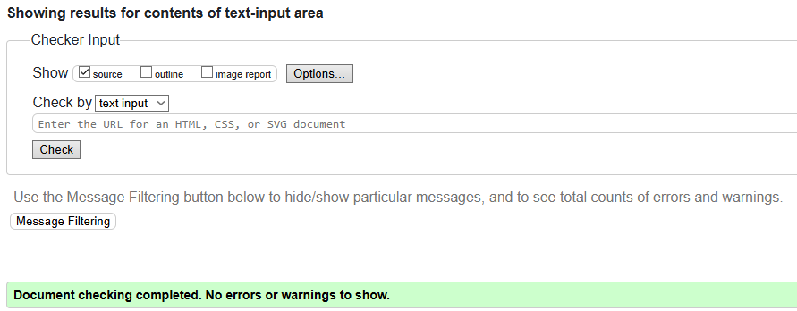

# MTG FORUM - A social media/ network platform for Magic: the Gathering players.
# Code Intstitute Milstone Project 3 - Full Stack Django Development

## Table of Contents

1. [Live Demo](#demo)
2. [Database ERD](#database-erd)
   + [CustomUser Model](#customuser-model)
   + [Post Model](#post-model)
   + [Comment Model](#comment-model)
3. [User Stories](#user-stories)
   + [Epics](#epics)
        + [User Profile](#user-profile)
        + [Content Interaction](#content-interaction)     
4. [Design](#design)
5. [Technologies](#technologies)
6. [Features](#features)
    + [Account Registration & User Profile](#account-registration--user-profile)
        + [Registration](#registration)
        + [User Profiles](#user-profiles)
    + [Content Interaction](#content-interactions)
        + [New Posts](#new-posts)
        + [Comments](#comments)
        + [Nested Replies](#nested-replies)
    + [Post Filtering & Finding](#post-filtering--finding)
        + [Categories](#categories)
        + [Favourites](#favourites)
        + [Popular Posts](#popular-posts)
        + [Search](#search)
    + [Edit & Delete](#edit--delete)
8. [Deployment](#deployment)
9. [Testing](#testing)
   + [Validation](#validation)
   + [Manual Testing](#manual-testing)   
11. [Credits](#credits)

## Demo
A live demo to the website can be found [here](https://mtg-forum-cea7e47cbcff.herokuapp.com/posts/)

# Database ERD
(picture of database ERD)
The database plan I had for this is simple enough. Almost everything is tied to the Author (Username) of the content. Posts use the title and "slugify" it into a unique indentifier, and it is tied to its Author. The comments are tied to thier Author and also the slug of the post, and as such will cascade on delete and be removed if the Authors account is deleted or removed or if the post is deleted or removed. Replies work in a similar way to the comments.

### CustomUser Model
   + username: CharField, Unique to each user, used as ForeignKey in Posts model
   + full_name: CharField, Full Name of the user
   + email: EmailField, Unique to each user, so each user must have a unique email
   + profile_picture: CloudinaryField, user provided profile picture with a default fallback.
      + post_count: Returns count of posts made by the user
      + comment_count: Returns count of comments made by the user
      + user_status: Returns the current admn status of the user (Superuser, Staff, Active, Inactive)

CustomUser model is shown here

    
    class CustomUser(AbstractUser):
        """
        Custom user model extending Django's AbstractUser.
        Adds full_name, unique email, and profile picture via Cloudinary.
        """
        full_name = models.CharField(max_length=255, blank=True, null=True)
        username = models.CharField(max_length=255, blank=True, null=True, unique=True)
        email = models.EmailField(unique=True)
        profile_picture = CloudinaryField(
            'image',
            blank=True,
            null=True,
            default='samples/cloudinary-icon'
        )
        
    @property
    def post_count(self):
        """Returns the count of posts authored by this user."""
        return self.posts.count()

    @property
    def comment_count(self):
        """Returns the count of comments authored by this user."""
        return self.comments.count()

    @property
    def user_status(self):
        """
        Returns a string representing the user's status:
        'Superuser', 'Staff', 'Active', or 'Inactive'.
        """
        if self.is_superuser:
            return "Superuser"
        elif self.is_staff:
            return "Staff"
        elif self.is_active:
            return "Active"
        else:
            return "Inactive"

    def __str__(self):
        return self.username

### Post Model
   + CATEGORY: const tuple, Selectable list of categories for posts
   + title: CharField, Unique title of the post
   + slug: SlugField, Unique slug for the posts navigation
   + author: ForeignKey, taken from CustomUser model username, with related_name='posts'
   + category: IntegerField, Chosen id of the category for the post
   + content: SummernoteTextField, RTF textarea for the posts main body content
   + created_on: DateTimeField, auto_now=True sets the date and time the post was created
   + excerpt: TextField, Auto generated from the first 200 words in a given post
   + updated_on: DateTimeField, auto_now=True sets the date/time when posts are edited
   + likes: ManyToManyField, CustomUser, realated_name='post_likes' has the logged in user liked this post
   + favourites: ManyToManyField, CustomUser, related_name='favourites' has the logged in user favourited this post
      + META, <code>ordeing = ["-created_on"]</code> shows the posts in descending order from most recent
      + is_edited, Returns True if post has been edited and displays updated on date/time
      + total_likes, Returns total amount of likes the post has
      + comment_count, Returns total amount of comments the post has had
      + get_absolute_url, fetch the url of the post_detail, injecting the correct slug
      + get_category_display_name, converts the Integer id of the category into text for display purposes

   
Post model shown here

   
      class Post(models.Model):
       """
       Model representing a forum post with categories, author, content,
       likes, favourites, and timestamps. Supports tracking likes and comments count,
       and provides utility methods for display and URLs.
       """
       CATEGORY = (
           (0, "Deck Techs"),
           (1, "Combos & Strategy"),
           (2, "Rules & Card Help"),
           (3, "Looking for Games"), 
           (4, "Social & Trading")
           )
       title = models.CharField(max_length=200, unique=True)
       slug = models.SlugField(max_length=200, unique=True)
       author = models.ForeignKey(
           settings.AUTH_USER_MODEL,
           related_name='posts',
           on_delete=models.CASCADE
       )
       category = models.IntegerField(choices=CATEGORY, default=0)
       content = SummernoteTextField()
       created_on = models.DateTimeField(auto_now_add=True)
       excerpt = models.TextField(blank=True)
       updated_on = models.DateTimeField(auto_now=True)
       likes = models.ManyToManyField(CustomUser, related_name='post_likes')
       favourites = models.ManyToManyField(CustomUser, related_name='favourite_posts', blank=True)
   
       class Meta:
           ordering = ["-created_on"]
   
       @property
       def is_edited(self):
           """Returns True if the post has been updated after creation."""
           return (self.updated_on - self.created_on) > timedelta(seconds=1)
       
       @property
       def total_likes(self):
           """Returns the total number of likes for the post."""
           return self.likes.count()
       
       @property
       def comment_count(self):
           """Returns the total number of comments associated with the post."""
           return self.comments.count()
   
       def __str__(self):
           """Returns a string representation of the post."""
           return f"{self.title} | written by {self.author}"
       
       def get_absolute_url(self):
           """Returns the URL to access a detail view of this post."""
           return reverse('post_detail', kwargs={'slug': self.slug})
       
       def get_category_display_name(self):
           """Returns the display name of the category."""
           return dict(self.CATEGORY).get(self.category)

### Comment Model
   + post: ForeignKey, Post, related_name='comments' The Post the comment has been made on pulled from Post model
   + author: ForeignKey, taken from CustomUser model username, with related_name='posts'
   + content: TextField, main body content of the comment
   + created_on: DateTimeField, auto_now_add=True Logs the date and time the comment was made
   + parent: ForeignKey, Hidden input, set to null to indicate a top level comment, otherwise, assigns the parent id for the comment its replying to. using this method, both comments and replies can be handled by the same model
      + META, <code>ordeing = ["-created_on"]</code> shows the posts in descending order from most recent

   
Comment model shown here

   
      class Comment(models.Model):
       """
       Model representing a comment on a Post, including support for threaded replies
       via a self-referential foreign key to a parent comment.
       """
       post = models.ForeignKey(Post, on_delete=models.CASCADE, related_name='comments')
       author = models.ForeignKey(
           settings.AUTH_USER_MODEL,
           related_name='comments',
           on_delete=models.CASCADE
       )
       content = models.TextField()
       created_on = models.DateTimeField(auto_now_add=True)
       parent = models.ForeignKey('self', null=True, blank=True, on_delete=models.CASCADE, related_name='replies')
   
       class Meta:
           ordering = ['-created_on']
   
       def __str__(self):
           """Returns a string representation of the comment."""
           return f"Comment by {self.author} on {self.post}"

# User Stories
When deciding on what I wanted to add to this project I looked at several soical media and forum style websites and took the greatest amount of inspiration from Reddit. To this effect, I wrote my user stories based on what I considered the cornerstone features of such a platform and split them into two Epics, User Profile and Content Interaction, detailed below, along with the acceptance criteria I decided for each user story. The kanban board for this project can be found [here](https://github.com/users/Arcandrus/projects/4/views/1)

## Epics

### USER PROFILE:

As a user, I want to create an account so that I can post, comment and interact.
+ User can register an account
+ User can Login to account  

As a user I want to be able to view a profile page with my information and the ability to see my posted content
+ User can access a profile page
+ Users profile page shows listed content created by the user
+ User has their own details displayed with certain fields allowing editing (display name)  

As a user I want to be able to change certain settings to enable me to customise and enjoy my experience better
+ User can reset password
+ User can delete account  

### CONTENT INTERACTION:

As a user I want to be able to create posts so I can share my thoughts in the forum
+ User can login and create post
+ Posts and comments should allow for the inclusion of images
+ User can see a list of their created posts
+ User can select a category for the post  

As a user I want to be able to like and comment on posts so I can express my feelings about the content
+ User can click a like button that tracks the number of total likes
+ User can post a comment to reply to any post
+ User can post a comment in a nested thread to reply to other comments
+ User can tag a post as a favourite  

As a user I want to be able to edit or delete my own content as needed
+ User can edit posts/ comments as needed
+ User can delete posts/ comment as needed  

As a user I want to be able to see what posts are popular to enable me to navigate quickly to active posts
+ User can view popular posts
+ User can filter by activity in a given time frame (24 hrs / 7 days / 30 days / All Time)  

As a user I want to be able to view the website on a mobile device to enable me to access the site from any device
+ Implement responsive design to allow for multiple screen sizes  

## Design
Taking into account Strategy, Scope, Structure, Skeleton and surface, together with User Stories and desired outcomes, this is what I considered while building this project.

To keep things cohesive and intuative, I had decided on having a sidebar navigation layout, with a persistent header and footer, all loaded and controlled by the **base.html** template. A wireframe of this initial design concept can be accessed in the [technologies](#technologies) section. I felt this enabled the most cohesive and consistent display of all the controls and options while giving plenty of space to display content to the user. I wanted all the controls for the user to be persitent and easy to understand, which is why I used the sidebar approach, included icon labels using FontAwesome. 

   
Screenshot of sidebar

   

The colour scheme I chose was a very calming and simple slate grey and white combination for maximum contrast and clarity while still being easier on the eyes than a plain white background with black text.

   
Color Palette

   

For visual clarity, links have a colour change when hovered, however, I considered mobile device users would not have this feature, and so, as part of my responsive design practice, I made links display with the default underline on smaller screens to make it clear what is a clickable link.

   
Example showing colour change

   

   
Example showing mobile links

   

## Technologies
**HTML** - To create a basic site skeleton and add the content. The site consists of HTML template partials loaded within the **base.html** template.

base.html is shown here

    
    
    
    
    
    
    
    <!DOCTYPE html>
    <html lang="en-US">
    
    <head>
        <meta charset="UTF-8">
        <meta name="viewport" content="width=device-width, initial-scale=1.0">
        <meta name="description" content="">
        <meta name="keywords" content="">
        <meta name="author" content="">
    
        <!-- FontAwesome Import -->
        
        <!-- Bootstrap CSS Import -->
        <link href="https://cdn.jsdelivr.net/npm/bootstrap@5.3.6/dist/css/bootstrap.min.css" rel="stylesheet"
            integrity="sha384-4Q6Gf2aSP4eDXB8Miphtr37CMZZQ5oXLH2yaXMJ2w8e2ZtHTl7GptT4jmndRuHDT" crossorigin="anonymous">
        <!-- jQuery (required by Summernote) -->
        
        <!-- Bootstrap JS (required by Summernote) -->
        
        <!-- Summernote CSS & JS -->
        <link href="https://cdn.jsdelivr.net/npm/summernote@0.8.20/dist/summernote.min.css" rel="stylesheet">
        
        <!-- Custom CSS -->
        <link rel="stylesheet" href="">
        <title>MTG Forum</title>
    </head>
    
    <body class="">
        <header>
            
            <h1>MTG FORUM</h1>
                

                <button id="menu-toggle" class="right hamburger" aria-label="Toggle sidebar">
                    &#9776;
                </button>
        </header>
    
        
 <!-- Flex container -->
    
            <aside class="sidebar">
                
                

                    

                        
                    

                    

                        
<strong>{{ user }}</strong>

                        
<strong><i class="fa-solid fa-pencil"></i> Posts:</strong> {{ user.post_count }}

                        
<strong><i class="fa-solid fa-comment"></i> Comments:</strong> {{ user.comment_count }}

                        
<strong><i class="fa-solid fa-circle-check"></i> Status:</strong> {{ user.user_status }}

                    

                

                
                

                    <form method="GET" action="">
                        <input type="text" name="q" placeholder="Search posts..." required>
                        <button class="btn search-btn btn-primary" type="submit" aria-label="Search">
                            <i class="fas fa-magnifying-glass"></i>
                        </button>
                    </form>
                

    
                <nav class="sidebar-nav" aria-label="Sidebar navigation">
                    <ul>
                        
                        <li><a href=""><i class="fa-solid fa-plus"></i> New Post</a></li>
                        <li><a href=""><i class="fa-solid fa-right-from-bracket"></i> Logout</a>
                        </li>
                        
                        <li><a href=""><i class="fa-solid fa-user-plus"></i> Register</a></li>
                        <li><a href=""><i class="fa-solid fa-right-to-bracket"></i> Login</a></li>
                        
    
                        <li>
                            

                        </li>
    
                        <li><a href=""><i class="fa-solid fa-house"></i> Home</a></li>
                        <li><a href=""><i class="fa-solid fa-list"></i> Categories</a></li>
                        <li><a href=""><i class="fa-solid fa-star"></i> Favourites</a></li>
                        <li><a href=""><i class="fa-solid fa-fire"></i> Popular</a></li>
    
                        <li>
                            

                        </li>
    
                        
                        <li><a href=""><i class="fa-solid fa-user"></i>
                                Profile</a></li>
                        <li><a href=""><i class="fa-solid fa-gear"></i> Settings</a></li>
                        
                        <li><a href=""><i class="fa-solid fa-user"></i> Profile</a></li>
                        
                    </ul>
                </nav>
            </aside>
            

    
            <main class="content flex-grow-1 p-3">
                
                <ul class="messages">
                    
                    <li class="{{ message.tags }}" >
                        {{ message }}
                        </li>
                        
                </ul>
                
    
                
                <!-- Content Goes here -->
                
            </main>
    
        

    
        <footer>
            
Copyright Eric Harper 2025

        </footer>
        
        
        
        
        
        
        
    
        <!-- Hamburger -->
        
    </body>
    
    </html>

**CSS** - To create a controlled and consistent display for each element and to give a great user experience. Using js, I applied a class based responsive design to the site.

**Javascript** - This is where most of the work for this project was done, as much of the system runs on Javascript
+ comments.js - Contains the functionality to post comments, post replies and edit/ delete both
+ favourite.js - Enables AJAX js for the favourtie button, both processing the form and updating the button
+ like.js - Enables the like button functionality in a similar vein to the favourite button
+ messages.js - Controls the display of Django messages
+ post_edit.js - Enables the inline form to allow users to edit any of thier own posts
+ screen_check.js - As part of responsive design, this js file checks for screen size changes as well as orientation changes

**Django** - This was the meat of the project, enabling full user controlled CRUD functionality. Implementing a CustomUser model as well as creating custom templates for much of the Django AllAuth library to allow for greater access and customisation across the sites features. 

**Balsamiq** - To create a wireframe, [here](mtg-forum-assets/mtg_forum.pdf) (pdf format)

**Bootstrap** - To ensure responsive design and usability across all devices, I use a combination of Bootstrap classes and custom css.

# Features
Most of the features I implemented were the direct responses to the User Stories listed above, as such, here follows an explaination of them in greater detail.

## Account Registration & User Profile

### Registration
I used Django AllAuth to enable users to register an account for creation of content. The AllAuth form template was replaced by a custom form to allow for adding feilds and greater control of styling.

    
The custom sign up form can be seen here

    
    class CustomSignupForm(SignupForm):
    """
    Custom signup form extending allauth's SignupForm.
    Adds fields for full name, username, email, and optional profile picture.
    Overrides save() to populate additional user fields.
    """
    full_name = forms.CharField(max_length=30, label='Full Name')
    username = forms.CharField(max_length=30, label='Username')
    email = forms.EmailField()
    profile_picture = forms.ImageField(required=False)

    def save(self, request):
        """
        Saves the user instance with additional fields from the signup form.
        """
        user = super(CustomSignupForm, self).save(request)
        user.full_name = self.cleaned_data['full_name']
        user.profile_picture = self.cleaned_data.get('profile_picture')
        user.save()
        return user

   
Screenshot of custom sign-up form

   

### User Profiles
Users also have access to profile pages. Thier own page will display all of their information and allow for them to use a form to edit this information.

   
Full Profile veiw, some information redacted

   

But if it is not your own profile page, it will hide senstive information like your name and email, and not give you the option to edit.

   
Minimal Profile veiw

   

The menu at the top allows any user to see the profile, posts made by the user, and any posts the user has left a comment on.

   
Menu and User filters

User Profile Menu 

Posts by User

Posts user has commented on

## Content Interactions

### New Posts
Users have the ability to create a new post from scratch. To do this, I implemented SummerNote rich-text editor to allow for greater flexibility and customisation to the user experience.

   
New post form

   

Upon saving, the user will be redirected to that posts display page.

   
Redirect to post detail

   

This is the main display for each post, and as per my wireframe, there are several interactive elements on these pages.
+ Clicking on the authors username wil take the user to that persons profile page
+ Clicking the Favourite star will tag the post as one of your favourites, meaning it will be listed on your favourites page, and the icon will turn from black to gold
+ Clicking the like button, styled to include the thumbs up icon, will "Like" the post and update the like count automatically, and the icon will turn into a solid thumbs up as opposed to an outline
+ Clicking the "Reply" button, styled to include the speech bubble icon and labelled with the current comment count for that post will open a modal to allow the user to leavea  comment on the post

   
Control Buttons

Like, Reply, Edit, Delete, Favourite 

### Comments
Using the "Reply" button users can leave comments by filling the information into a modal window, which will save the comment content as a top level comment with no parent comment, but linked to the post via a related-name within the model.

   
Comment Modal

   

   
Comment displayed under post

   

### Nested Replies
Each comment will render with its own reply button, allowing for users to reply in nested threads and have conversations about a topic. This button opens the same comment modal but this time saves a hidden input in the form of the comment parent id, so that each reply know which comment it should be nested below.

   
Nested replies example

   

## Post Filtering & Finding

### Categories
The categories page will enable users to filter all posts within one of the five defined categories by using the dropdown menu at the top.

   
Category Menu

   

Once chosen, the title will update to show the selected category and the posts within that will be displayed in a paginated by 4 format, displaying on a minimal card in a 2x2 grid, including the like count, comment count, date/time of creation, authors information and favourite star. The favourite star and username profile links are available on theis page but the like and comment are disabled to encourage the user to visit the post to engage further.

   
Category Chosen

   

### Favourites
The favourites page will show, in the same paginated by 4 style, the posts that the user has tagged as a favourite, with the star being gold.

   
Favourites page

   

### Popular Posts
On the popular posts page, using the same paginated by 4 style, it shows the posts sorted by an "Activity" score which takes into account hte amount of likes and comments a post has had in a given time period. A dropdown menu will allow the user to decide which time frame they wish to veiw by, 24hrs, 7 days, 30 days or All time.

   
Popular Filter Menu

   

   
Popular page display

   

### Search
Old reliable, I've included a search functionality within the sidebar, which displays a paginated by 4 style again, and will show any results that include the serach phrase or username entered by the user.

   
Search Results

   

## Edit & Delete
If the author of a post or comment is looking at thier own content, there will be two control buttons displayed, one for editing and one for deleting. These only appear on content the logged in user has created themselves. 

When clicked the edit button overwrites the element content with a summernote edit form that allows the content to be editted and saved.

   
Edit Post

   

   
Edit Comment

   

The delete button will prompt to user to confirm, and upon confrimation witll delete the post/ comment and any nested replies from the database.

   
Delete Comment

   

# A quick word on image integration with SummerNote
I wanted to allow users to upload images as part of posts, comments and replies, using SummerNote and Cloudinary integration, however, due to time constraints I was not able to get this feature implemented. My initial attpemts to integrate this feature had several issues and setbacks I was unable to overcome.

# Deployment 
1. Log in to Heroku if you already have an account with them. If not, create an account.
2. Once signed in, click on the "Create New App" button located above your dashboard. Give your app a unique name, choose the region you're in (United States/Europe) and click "Create app".
3. Before deploying, you need to go to the Settings tab. Once there, scroll down and click on Reveal Config Vars to open this section.
4. In this section, enter all of your environment variables that are present in your env.py file. Fields like DATABASE_URL, SECRET_KEY, CLOUDINARY_URL (if using Cloudinary), EMAIL_HOST_USER and EMAIL_HOST_PASSWORD if you are planning on sending emails to users (like having a Reset Password functionality).
5. After that, make sure to go to the Resources tab and make sure Heroku didn't automatically set up a database for you. If that happens, simply remove the PostgreSQL database.
6. Now, go to the Deploy tab. Once there, in the Deployment Method section, click GitHub and if needed, authorize GitHub to access your Heroku account. Click Connect to GitHub.
7. Once connected, look up your GitHub repository by entering the name of it under Search for a repository to connect to and click Search. After you've found your repo, click Connect.
8. I used manual deployment throughout this project, so once I had done a GitHub push, I navigated here and clicked Deploy Branch. If you enabled automatic deploys, every time you push changes to GitHub, the app will be automatically deployed every time, just like you would with a webpage deployed on GitHub Pages.
8. The app can take a couple of minutes until it's deployed. Once it's done, you'll see the message Your app was successfully deployed and a "Open App" button will be displayed at the top of the screen, where you can see your deployed app.

# Testing

## Validation

**HTML**  
[W3C HTML validator](#https://validator.w3.org) seemed to really struggle with the Django generateed content so I instead validated the raw HTML after Django rendering, which showed no errors

   
HTML Pass

   

**CSS**  
[W3C CSS Validator](#https://jigsaw.w3.org/css-validator/) showed no errors.

   
CSS Pass

   

**JS**  
[BeautifyTools JS Validator](#https://beautifytools.com/javascript-validator.php) was used to validate all my js scripts and each returned no errors. I've included one screenshot, but I ran every script through the validator.

   
JS Pass

   

**Python**  
[Pep8 CI](#https://pep8ci.herokuapp.com) was used to validate all *.py files and with the exception of a couple of trailing whitespaces and incorrect spacing, which I then fixed, everything came back clear.

**Lighthouse**  
DevTools Lighthouse Scores. The big problem with the Best Practices score was the third party cookies, most of which were the cloudinary images, and I'm not sure how to make this any better.

   
Lighthouse

   

## Manual Testing

### Manual Testing

All these features were manually tested by me and several others, these are the results of those tests.

| Feature | Expectation | Action | Result |
| ---------- | ---------- | ------------ | ----------- |
|Registering an account| Users can submit a form to register an account | I had several people sign up and create accounts, using the "Register" link |Working as intended|
|Logging in| Users can use thier credentials to log in | Myself and several testers checked the functionality using the "Login" link |Working as intended|
|Logging out| Users can log out to keep thier account secure | Myself and several testers checked the functionality using the "Logout" link|Working as intended|
|Veiwing profiles| Clicking on a username or the profile link displays a user profile | Myself and several testers checked the functionality both by clicking on a username and using the "Profile" link |Working as intended|
|Creating a post| Users can select "New Post" and create a new post | Myself and several testers checked the functionality by using the "New Post" link and posting several new posts |Working as intended|
|Posting a comment| Users can reply to posts with a "Comment" | Myself and several testers checked the functionality using the "Reply" button on a post |Working as intended|
|Posting a reply| Users can create nested "Reply" chains by replying to comments | Myself and several testers checked the functionality by replying sometimes three layers deep to make sure it kept working |Working as intended|
|Liking a post| Users can "Like" a post either on the main page or the detailed view | Myself and several testers checked the functionality using both the "Like" buttons |Working as intended|
|Adding a post to favourites| Users can click the "Favourite" start button to add a post to a list of thier favourites | Myself and several testers checked the functionality, and checked that clicking it again removes it from favourites |Working as intended|
|Browsing by category| Users can filter posts by category on the categories page | Myself and several testers checked the functionality using the filtered options |Working as intended|
|Browsing by popular| Users can see a display of the most popular posts for a given time period | Myself and several testers checked the functionality and tested each time period, all displayed correctly |Working as intended|
|Searching for content| Users can type a string into the search bar to find specific content | Myself and several testers checked the functionality, initially it didn't include the ability to search usernames but I have updated it to include this functionality |Working as intended|
|Editing posts| Users can click the "Edit" button if they are the author of the post to make changes using an inline form approach | Myself and several testers checked the functionality |Working as intended|
|Editing Comments| Users can click the "Edit" button if they are the author of the comment/reply to make changes using an inline form approach | Myself and several testers checked the functionality |Working as intended|
|Editing profile information| Users can edit thier profile information to change thier full name, username, email and profile picture | Myself and several testers checked the functionality using the "Edit Profile" button on the profile page when logged in |Working as intended|
|Reseting passwords| Users can reset thier password by reciveing an email with a reset link | I tested this with a dummy profile |Working as intended|
|Deleting posts| Users can remove posts if they are the author | Myself and several testers checked the functionality using the "Delete" button, all comments and replies are deleted as part of CASCADE |Working as intended|
|Deleting comments| Users can remove comments/replies if they are the author | Myself and several testers checked the functionality using the "Delete" button | Myself and several testers checked the functionality using the "Delete" button, all comments and replies are deleted as part of CASCADE |Working as intended|
|Deleting account| Users can delete thier account | I tested this with a dummy profile |Working as intended|

While developing this project, I mainly relied on DevTools, Google, ChatGPT and StackOverFlow to help me with troubleshooting and bug fixing.

I have also asked several users to explore the website on different devices including iPhone 14, iPad, Oppo mobile devices, Sony mobile devices and several different PC and Laptop setups to ensure consitency and usability across multiple platforms.

## Major Bugs & Errors
There was only one moment I had a site breaking error. I had my js set up to read my buttons based on the innertext of said button, for example "Reply". This text was always supposed to be considered placeholder, but I didn't make the correct adjustments to the js when I switched the button to display icons instead of text. As such the whole comments system broke into pieces and I spent several hours until I figured out ths issue and made the corrections. After this, everything worked as expected.

The other minor bug to work around was the edit button was saving the content as RTF and rendering it with {{ post.content | safe }}. Little did I know at the time because of the way I had implemented my js, the contents of the button would change if any HTML markup characters were used in the edited content, like "". I solved this issue by creating a hidden div to store the content before it was saved and then inject that content into the correct div in the HTML, thus bypassing the buttons interaction with the content dorectly.

# Credits
I would like to thank my mentor, Medale Oluwafemi, for his insights and support during this project.

MASSIVE thank you to my best friends Rew and Emma for thier continued support and belief in me as I've progressed as well as thier help testing functionality and features and thier valuable feedback, I love you both.

Thanks go to the Frome MTG club who have also helped me with testing and troubleshooting. 

I would also like to credit ChatGPT for helping me with specific debugging and formatting issues I faced when building this project, as well as helping me to refactor redundant code.
